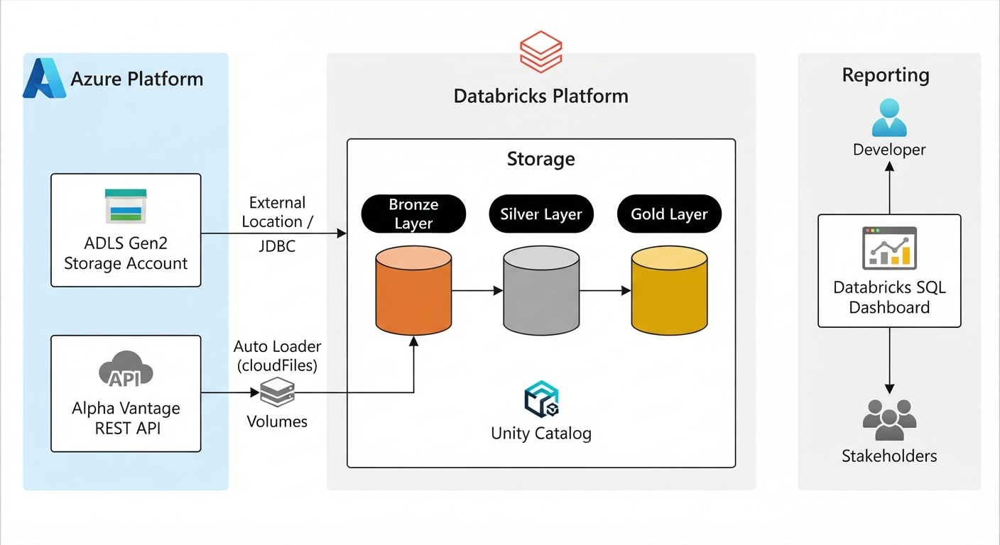

# Databricks - Data Engineering Track

## Introduction

Financial services organizations increasingly run their transaction analytics and market-data
pipelines on cloud lakehouse platforms rather than traditional on-prem warehouses, because they
need to combine large historical batch data with continuously arriving external data in one
governed place. This folder is a hands-on Data Engineering track built around that reality: two
independent pipelines are implemented on Databricks against two different problem shapes -
batch fraud analytics over an existing transaction dataset, and a continuously ingested external
market-data feed - plus a set of foundational exercises used to build up the underlying PySpark
skills.

The work is delivered as a set of Databricks notebooks, using the following stack:

- **Databricks** (notebooks, Unity Catalog, Delta Live Tables, Auto Loader, Volumes) as the
  processing and orchestration platform
- **PySpark / Spark SQL** for all data transformation logic
- **Delta Lake** as the storage format backing every bronze/silver/gold table
- **Azure Data Lake Storage (ADLS Gen2)** as the source system for the transaction dataset
- **Alpha Vantage REST API** as the external source for the market-data pipeline
- **Databricks Volumes** as the raw JSON landing zone for streamed API data

---

## Databricks Implementation

**Architecture Diagram**

### 1. ETL in Databricks - Credit Card Transaction & Fraud Analytics

**Dataset:** a credit-card transaction dataset (users, cards, transactions, MCC codes, and
fraud labels) landed in ADLS Gen2 as CSV/JSON, covering roughly 13.3M transactions.

**Notebooks:**

- [01 - Bronze Ingestion](./ETL%20in%20Databricks/01_bronze_ingestion.ipynb)
- [02 - Silver Transform](./ETL%20in%20Databricks/02_silver_transform.ipynb)
- [03 - Gold Aggregates](./ETL%20in%20Databricks/03_gold_aggregates.ipynb)

**Analytics work:**

- **Bronze** - reads the raw CSV/JSON files from an ADLS Gen2 external location
  (`abfss://landing@...`), flattens the nested MCC-code and fraud-label JSON maps, and lands each
  source as-is into a `bronze` schema with `_ingested_at` / `_source` lineage columns.
- **Silver** - casts and cleans every bronze table (typed IDs, parsed timestamps, trimmed
  strings, boolean flags for `has_chip` / `is_fraud`), and derives analysis-ready columns such as
  day-of-week, hour, and time-of-day buckets on the transaction table.
- **Gold** - aggregates the silver transaction table into business-facing tables: fraud rate by
  day of week, by time of day, by day (`fraud_daily`), by merchant category (`fraud_by_mcc`), by
  user (`fraud_by_user`), and a transaction amount profile split by fraud status.

**Architecture:** ADLS Gen2 (raw files) → Bronze Delta tables (Unity Catalog) → Silver Delta
tables (cleaned/typed) → Gold Delta tables (fraud aggregates) → consumed via Databricks SQL /
Unity Catalog. Every stage is a batch PySpark job writing managed Delta tables under a
catalog-scoped `bronze` / `silver` / `gold` schema.

### 2. DLT in Databricks - Alpha Vantage Market Data Pipeline

**Dataset:** daily prices and real-time quotes for a small basket of tickers (AAPL, MSFT, NVDA,
AMZN), pulled live from the Alpha Vantage API.

**Notebooks:**

- [01 - Ingest Alpha Vantage](./DLT%20in%20Databricks/01_ingest_alpha_vantage.py.ipynb)
- [02 - DLT Pipeline](./DLT%20in%20Databricks/02_dlt_pipeline.py.ipynb)

**Analytics work:**

- **Ingestion** - a scheduled notebook calls the Alpha Vantage REST API (API key held in
  Databricks secrets), throttled to stay within the free-tier rate limit, and writes each
  response as newline-delimited JSON into a Databricks Volume landing zone, partitioned by run
  date.
- **DLT pipeline** - a Delta Live Tables pipeline reads the landing zone with Auto Loader
  (`cloudFiles`, schema inference off, streaming), and declares the bronze → silver → gold table
  chain declaratively with `@dlt.table`, letting Databricks manage checkpointing, incremental
  processing, and data-quality expectations.

**Architecture:** Alpha Vantage API → Databricks Volume (raw JSON landing zone) → Auto Loader
(streaming ingestion) → DLT declarative pipeline (bronze/silver/gold live tables) → Unity
Catalog. This pipeline is continuous/incremental rather than batch, which is the main design
difference from the ETL project above.

### 3. PySpark Fundamentals

Supporting exercise notebooks built against the [pgexercises](https://pgexercises.com/gettingstarted.html)
dataset (`bookings.csv`, `facilities.csv`, `members.csv`), covering DataFrame ETL basics, managed
(Hive) vs. external tables, DBFS, and writing results to Parquet and partitioned Delta tables.
These notebooks are training material rather than a standalone deliverable, but they underpin the
PySpark patterns used in the two pipelines above.

---

## Future Improvement

1. **Automate and schedule both pipelines end-to-end.** The ETL notebooks currently run manually
   in sequence; wiring them into a Databricks Workflow (with the DLT pipeline scheduled
   independently) would remove the manual trigger step and give both projects proper run history
   and alerting.
2. **Add data-quality enforcement.** The DLT pipeline can adopt `@dlt.expect` constraints (e.g.
   non-null transaction IDs, valid MCC codes) to quarantine bad records automatically, and the
   same expectations should be backported to the ETL bronze/silver checks, which today are
   ad-hoc `COUNT`/`WHERE` sanity checks run by hand.
3. **Replace the interim CSV path for cards/transactions with the intended JDBC source.** The
   bronze notebook notes that direct JDBC ingestion from Azure SQL was blocked by connectivity
   and falls back to CSV exports; resolving that connectivity would let the pipeline ingest
   directly from the system of record instead of a manual export.
4. **Surface the gold tables in a dashboard.** The fraud aggregates in `gold.*` are query-ready
   but not yet exposed anywhere; a Databricks SQL dashboard (fraud rate trend, top MCC categories,
   highest-risk users) would turn the gold layer into something stakeholders can actually consume.
