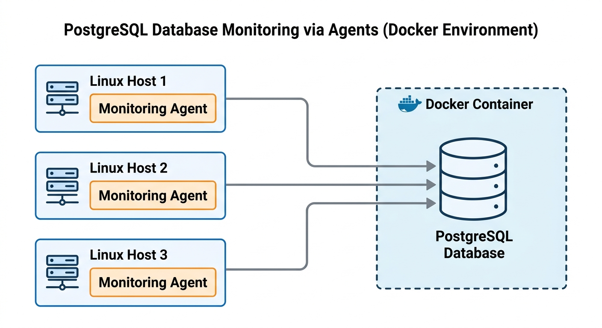

# Linux Cluster Monitoring Agent

## Introduction

This project is a Linux cluster monitoring agent built for a team managing multiple Rocky Linux servers on Google Cloud Platform. The goal is simple: automatically collect hardware specifications and real-time resource usage data from each server and store it in a centralized PostgreSQL database for analysis.

Each server runs two Bash scripts. The first script, `host_info.sh`, runs once and captures static hardware details like CPU model, architecture, memory, and cache size. The second script, `host_usage.sh`, runs every minute via crontab and records live metrics such as free memory, CPU idle percentage, disk I/O, and available disk space. All data is persisted into a PostgreSQL instance running inside a Docker container, making the setup portable and easy to reproduce across any host in the cluster.

Technologies used: Bash, PostgreSQL, Docker, Git, and Linux system tools including `lscpu`, `vmstat`, and `df`.

---

## Quick Start

```bash
# 1. Start the PostgreSQL Docker container
bash scripts/psql_docker.sh start

# 2. Create the database tables
psql -h localhost -U postgres -d host_agent -f sql/ddl.sql

# 3. Collect and insert hardware specs (run once per host)
bash scripts/host_info.sh localhost 5432 host_agent postgres password

# 4. Collect and insert resource usage (run manually or via crontab)
bash scripts/host_usage.sh localhost 5432 host_agent postgres password

# 5. Automate resource usage collection every minute
crontab -e
# Add the following line:
* * * * * bash /home/rocky/dev/jarvis_data_eng_MahmoudElboghdady/linux_sql/scripts/host_usage.sh localhost 5432 host_agent postgres password > /tmp/host_usage.log 2>&1
```

---

## Implementation

### Architecture

The diagram below shows the cluster setup. Each Linux host runs a monitoring agent that pushes data into a PostgreSQL database running inside a Docker container on the host machine.



### Scripts

**`psql_docker.sh`**
Manages the PostgreSQL Docker container. Supports `start`, `stop`, and `create` actions.

```bash
bash scripts/psql_docker.sh start
bash scripts/psql_docker.sh stop
bash scripts/psql_docker.sh create db_username db_password
```

**`host_info.sh`**
Collects static hardware specifications and inserts them into the `host_info` table. Run this once when a new host joins the cluster.

```bash
bash scripts/host_info.sh psql_host psql_port db_name psql_user psql_password

# Example
bash scripts/host_info.sh localhost 5432 host_agent postgres password
```

**`host_usage.sh`**
Collects real-time CPU and memory usage and inserts a new row into the `host_usage` table. Designed to run every minute via crontab.

```bash
bash scripts/host_usage.sh psql_host psql_port db_name psql_user psql_password

# Example
bash scripts/host_usage.sh localhost 5432 host_agent postgres password
```

**crontab**
Automates `host_usage.sh` to run every minute. Output is logged to `/tmp/host_usage.log` for debugging.

```bash
* * * * * bash /home/rocky/dev/jarvis_data_eng_MahmoudElboghdady/linux_sql/scripts/host_usage.sh localhost 5432 host_agent postgres password > /tmp/host_usage.log 2>&1
```

**`ddl.sql`**
Automates the creation of the `host_info` and `host_usage` tables in the `host_agent` database. Safe to re-run due to `IF NOT EXISTS` clauses.

```bash
psql -h localhost -U postgres -d host_agent -f sql/ddl.sql
```

### Database Modeling

**`host_info`**

| Column | Data Type | Constraints | Description |
|---|---|---|---|
| id | SERIAL | PRIMARY KEY | Auto-incremented host identifier |
| hostname | VARCHAR | NOT NULL, UNIQUE | Fully qualified hostname |
| cpu_number | INT2 | NOT NULL | Number of logical CPUs |
| cpu_architecture | VARCHAR | NOT NULL | CPU architecture (e.g. x86_64) |
| cpu_model | VARCHAR | NOT NULL | CPU model name |
| cpu_mhz | FLOAT8 | NOT NULL | CPU clock speed in MHz |
| L2_cache | INT4 | NOT NULL | L2 cache size in kB |
| total_mem | INT4 | NOT NULL | Total memory in kB |
| timestamp | TIMESTAMP | NOT NULL | Time the record was inserted (UTC) |

**`host_usage`**

| Column | Data Type | Constraints | Description |
|---|---|---|---|
| timestamp | TIMESTAMP | NOT NULL | Time the record was inserted (UTC) |
| host_id | INT4 | NOT NULL, FOREIGN KEY | References host_info(id) |
| memory_free | INT4 | NOT NULL | Free memory in MB |
| cpu_idle | INT2 | NOT NULL | CPU idle percentage |
| cpu_kernel | INT2 | NOT NULL | CPU kernel usage percentage |
| disk_io | INT4 | NOT NULL | Number of disk I/O operations in progress |
| disk_available | INT4 | NOT NULL | Available disk space on root in MB |

---

## Test

Both scripts were tested manually on a Rocky Linux 9 GCP instance before being automated via crontab.

For `host_info.sh`, the script was run with `bash -x` to trace every variable assignment and confirm each value was parsed correctly from `lscpu` and `/proc/meminfo`. The psql CLI confirmed a successful insert with `INSERT 0 1`. The inserted row was verified with `SELECT * FROM host_info`.

For `host_usage.sh`, the same approach was used. `vmstat` column numbers were verified first to ensure `cpu_idle` and `cpu_kernel` mapped to the correct columns on this specific machine. The insert returned `INSERT 0 1` and the row was confirmed in the database.

After crontab was configured, the `host_usage` table was queried after several minutes and showed one new row per minute with accurate timestamps, confirming the automation worked correctly.

---

## Deployment

The PostgreSQL database runs inside a Docker container managed by `psql_docker.sh`, which makes the database layer portable and straightforward to restart. The monitoring agent scripts are stored in the GitHub repository and pulled onto each host. Hardware data is collected once per host using `host_info.sh`. Resource usage is collected continuously using `host_usage.sh`, which is deployed via Linux crontab to execute every minute without any manual intervention.

---

## Improvements

- Add support for detecting and updating hardware records when a host's specs change, rather than assuming hardware is always static.
- Implement alerting logic that triggers a notification when resource usage crosses a defined threshold, such as CPU idle dropping below 10% or free memory falling under 500 MB.
- Add a cleanup job that archives or deletes `host_usage` records older than a defined retention period to prevent the table from growing indefinitely.
