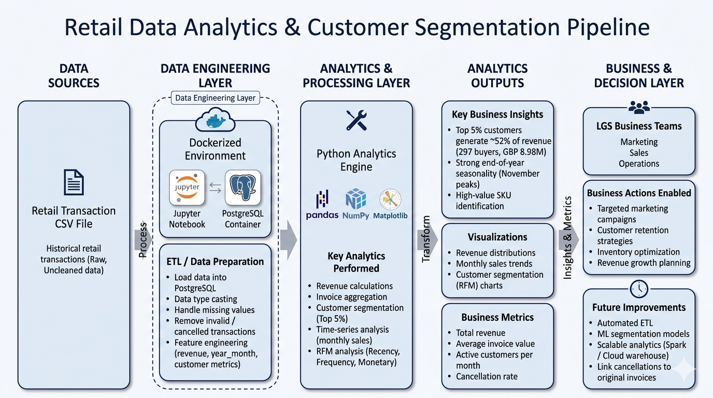

# Python Data Analytics - LGS Retail Project

## Introduction

London Gift Shop (LGS) is a UK online giftware retailer with more than ten years of trading history and a customer base that mixes individual buyers with wholesale accounts. Despite the long operating record, top-line revenue has flattened and the marketing team has very little visibility into who their customers actually are or what drives a sale. This project is a Proof of Concept that turns LGS's raw transaction history into evidence the marketing team can act on.

The aim is to convert two years of transactional records into a small set of analytical outputs that answer specific business questions:

- Which customers generate the bulk of revenue, and how concentrated is that revenue?
- When does demand peak, and how steady is the seasonal pattern?
- How are cancellations behaving, and how do they distort the headline numbers?
- How can the customer base be grouped into segments that marketing can address differently?

The work is delivered as a Jupyter notebook plus an executive presentation, using the following stack:

- **Python** as the analytics language
- **Pandas and NumPy** for data wrangling and feature engineering
- **Matplotlib and Seaborn** for charts and exploratory visualisation
- **PostgreSQL** as the source store that holds the loaded transaction data
- **Jupyter Notebook** as the working environment for exploration and reporting
- **Docker** to make the environment portable and reproducible across machines

---

## Implementation

### Project Architecture

The pipeline is intentionally lightweight - it is a PoC, not a production system - and follows five clear steps from raw data to business outcome:

1. **Data ingestion**
    - LGS IT exports the transactional records as a SQL dump (`retail.sql`) covering 01/12/2009 through 09/12/2011
    - All personal data (name, address, phone) is stripped by LGS before the file is handed over
2. **Data storage**
    - The dump is loaded into a local PostgreSQL instance, which acts as the working store for the PoC
    - SQL is used to validate row counts, sanity-check schemas and explore the raw tables
    - In a real production setup this layer would be replaced by a managed cloud warehouse such as Snowflake, BigQuery or Synapse
3. **Analytics processing**
    - A Jupyter notebook connects to PostgreSQL through SQLAlchemy / psycopg2 and pulls the data into a Pandas DataFrame
    - Cleaning, type-casting, derivations and aggregations all happen in Pandas, which is fast enough for the dataset size (around 1.07M rows)
4. **Analytics outputs**
    - Headline business metrics: total revenue, average invoice value, active customers per month
    - Time-based features: monthly sales, month-over-month growth, seasonality curves
    - Customer-level features: Recency / Frequency / Monetary scores and named RFM segments
5. **Consumption by LGS**
    - Marketing uses the insights to plan tiered, segment-specific campaigns
    - Operations uses the seasonality view for stock and capacity planning
    - The engineered customer features can later feed dashboards or downstream ML models

**Architecture Diagram**

---

### Data Analytics and Wrangling

All wrangling and analytical code lives in the notebook:

**[Retail Data Analytics & Wrangling Notebook](./retail_data_analytics_wrangling.ipynb)**

The notebook is organised top-down so a fresh kernel can run it end-to-end. The work it performs:

- Pulls the retail transactions out of PostgreSQL into a Pandas DataFrame
- Profiles the raw data (row counts, null counts, dtypes, descriptive stats)
- Cleans and standardises the data: snake_case column names, datetime parsing on `invoice_date`, numeric coercion on `quantity` and `unit_price`, deduplication, and removal of rows where customer-level analysis is not possible
- Splits the records into two frames - placed orders (positive `total_amount`) and cancelled orders (negative `total_amount`) - so revenue figures stay honest
- Engineers a set of analytical features that the rest of the analysis builds on:
    - `total_amount` per line and per invoice
    - Monthly sales totals and month-over-month growth percentage
    - Active customers per month
    - New versus existing customer flags using each customer's first-purchase month
    - Cancellation counts and patterns
    - RFM scores (Recency, Frequency, Monetary) and named segments such as Champions, Loyal Customers, At Risk, and Hibernating

### How This Data Helps LGS Increase Revenue

The findings translate directly into actions the marketing team can take:

- **Protect the customers who matter most.** A small slice of buyers drives the majority of revenue. Knowing exactly who they are lets LGS build a tiered loyalty programme that focuses retention spend where it produces the largest return.
- **Time campaigns around proven demand peaks.** The seasonality view shows a strong, repeatable end-of-year peak. Front-loading marketing spend, supplier negotiations and stock planning around that peak is a low-risk, high-return play.
- **Stop cancellations from hiding the real picture.** Treating cancellations as a separate stream gives a cleaner view of net revenue and surfaces a small but important schema gap that LGS IT can close in the source system.
- **Replace generic emails with named-segment campaigns.** The RFM segmentation hands marketing a ready-made customer taxonomy. Champions, At Risk and Hibernating customers each get their own message, cadence and offer instead of one blanket campaign.

---

## Improvements

If more time were available, three improvements would push this PoC closer to a production capability:

1. **Productionise the data pipeline**
    - Replace the manual SQL dump with a scheduled, automated ingestion (Airflow or Azure Data Factory)
    - Add data-quality checks (Great Expectations or similar) so bad data is caught at load time rather than during analysis
    - Move the heavy lifting from in-notebook Pandas into the warehouse using SQL plus dbt
2. **Add machine-learning capability on top of the engineered features**
    - Train a customer segmentation model that updates as behaviour shifts, instead of relying on a static RFM run
    - Build a seasonal demand-forecasting model so stock and marketing budgets can be planned several months ahead
    - Surface the predictions back into the marketing tooling so campaigns can act on them automatically
3. **Close the data-quality gaps the analysis exposed**
    - Extend the source schema with an `original_invoice_no` column on cancellation records so cancellation rate can be measured cleanly per customer and per product
    - Introduce a product master table to standardise the free-text product descriptions and enable accurate SKU-level analysis

---
